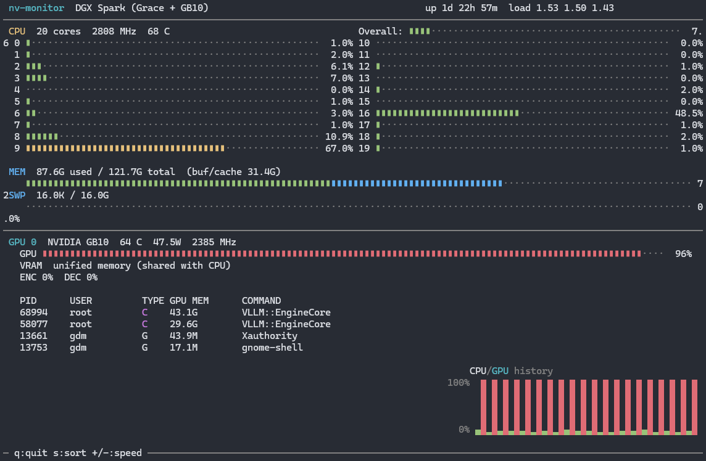

# nv-monitor

A lightweight terminal system monitor built for the **NVIDIA DGX Spark** (Grace CPU + GB10 GPU). Think htop + nvtop in a single 73KB binary.

  

## Features

- **CPU**: Per-core usage bars (dual-column layout), frequency, temperature, overall aggregate
- **Memory**: Used/total with buf/cache segmented bar, swap usage
- **GPU**: Utilization bar, temperature, power draw, clock speed, encoder/decoder utilization
- **GPU Processes**: PID, user, type (Compute/Graphics), GPU memory, command name
- **Unified Memory**: Gracefully handles the DGX Spark's shared CPU/GPU memory architecture
- **History Chart**: Rolling CPU/GPU usage graph (last 20 samples) using Unicode block elements
- Color-coded bars (green/yellow/red) based on utilization thresholds
- **CSV Logging**: Log all stats to file with configurable interval
- **Headless Mode**: Run without TUI for unattended data collection
- 1s default refresh, adjustable at runtime or via CLI
- NVML loaded dynamically at runtime — no hard dependency on NVIDIA drivers



## Download

For the reckless among you, there's a [binary release](https://github.com/wentbackward/nv-monitor/releases) you can download if you don't want to build it yourself.

## Building

Requires `gcc` and `libncurses-dev`:

```bash
sudo apt install build-essential libncurses-dev
make
```

## Usage

```bash
./nv-monitor                           # TUI only
./nv-monitor -l stats.csv              # TUI + log every 1s
./nv-monitor -l stats.csv -i 5000      # TUI + log every 5s
./nv-monitor -n -l stats.csv -i 500    # Headless, log every 500ms
./nv-monitor -r 2000                   # TUI refreshing every 2s
```

Or install system-wide:

```bash
sudo make install
```

### Command-line options

| Flag      | Description                          | Default |
|-----------|--------------------------------------|---------|
| `-l FILE` | Log statistics to CSV file           | off     |
| `-i MS`   | Log interval in milliseconds         | 1000    |
| `-n`      | Headless mode (no TUI, requires `-l`)| off     |
| `-r MS`   | UI refresh interval in milliseconds  | 1000    |
| `-h`      | Show help                            |         |

### Interactive controls

| Key     | Action                              |
|---------|-------------------------------------|
| `q`/Esc | Quit                                |
| `s`     | Toggle sort (GPU memory / PID)      |
| `+`/`-` | Adjust refresh rate (250ms steps)   |

## Requirements

- Linux (reads from `/proc` and `/sys`)
- ncurses
- NVIDIA drivers with NVML (for GPU monitoring — CPU/memory work without it)

Tested on DGX Spark (aarch64, CUDA 13.0, driver 580.x) but should work on any Linux system with an NVIDIA GPU.

## License

MIT
