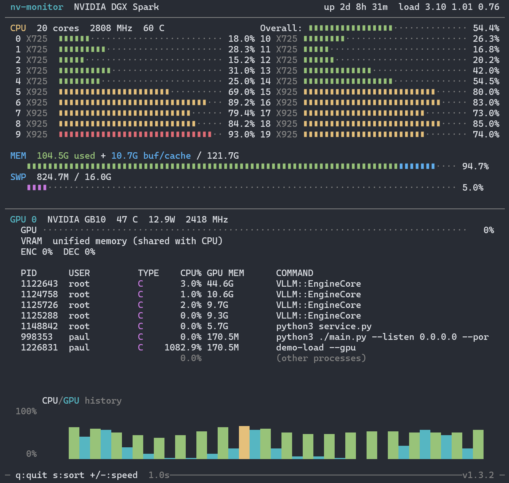
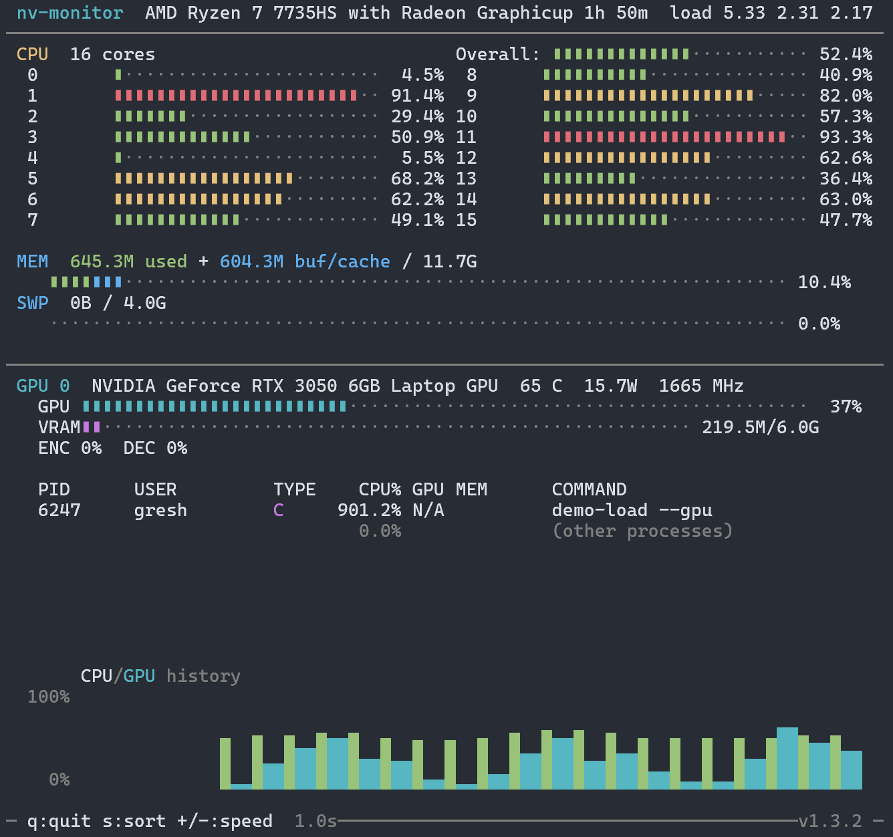

# nv-monitor

Local monitoring TUI, CSV logger, and Prometheus/OpenMetrics exporter for NVIDIA GPU systems — all in a single <80KB binary with zero runtime dependencies. Built for the **DGX Spark** (Grace + GB10), works on any Linux system with an NVIDIA GPU.

Accurately monitor a single machine or an entire cluster with minimal overhead. Reports metrics to NVIDIA specifications via NVML, with correct handling of unified memory, HugePages, and ARM big.LITTLE core topology. Includes `demo-load`, a zero-dependency synthetic CPU/GPU load generator for validating your monitoring pipeline end-to-end.

  

## Display

### CPU Section
- **Overall** aggregate usage bar across all cores
- **Per-core** usage bars in dual-column layout with ARM core type labels (**X925** = performance cores at 3.9 GHz, **X725** = efficiency cores at 2.8 GHz on the Grace big.LITTLE architecture)
- CPU temperature (highest thermal zone) and frequency

### Memory Section
- **Used** (green) — actual application memory (total - free - buffers - cached)
- **Buf/cache** (blue) — kernel buffers and page cache (reclaimable)
- Swap usage bar
- Correctly handles **HugePages** on DGX Spark where `MemAvailable` is inaccurate

### GPU Section
- **GPU utilization** bar with temperature, power draw (watts), and clock speed
- **VRAM** bar, or "unified memory" label on DGX Spark where CPU/GPU share memory
- **ENC/DEC** — hardware video encoder (NVENC) and decoder (NVDEC) utilization percentage

### GPU Processes
- **PID** — process ID
- **USER** — process owner
- **TYPE** — **C** (Compute: CUDA/inference workloads) or **G** (Graphics: rendering, e.g. Xorg)
- **CPU%** — per-process CPU usage (delta-based, per-core scale)
- **GPU MEM** — GPU memory allocated by the process
- **COMMAND** — binary name with arguments
- **(other processes)** — summary row showing CPU usage from non-GPU processes

### History Chart
- Full-width rolling graph of CPU (green) and GPU (cyan) utilization over the last 20 samples using Unicode block elements (▁▂▃▄▅▆▇█)

### General
- Color-coded bars: green (normal), yellow (>60%), red (>90%)
- **CSV Logging** — log all stats to file with configurable interval
- **Headless Mode** — run without TUI for unattended data collection
- 1s default refresh, adjustable at runtime or via CLI
- NVML loaded dynamically at runtime — no hard dependency on NVIDIA drivers

<table>
<tr>
<td><strong>aarch64</strong> (DGX Spark — Grace + GB10)</td>
<td><strong>x86_64</strong> (Laptop — Ryzen 7 + RTX 3050)</td>
</tr>
<tr>
<td></td>
<td></td>
</tr>
</table>

## Download

For the reckless among you, there's a [binary release](https://github.com/wentbackward/nv-monitor/releases) you can download if you don't want to build it yourself.

## Building

Requires `gcc` and `libncurses-dev`:

```bash
sudo apt install build-essential libncurses-dev
make
```

## Usage

```bash
./nv-monitor                           # TUI only
./nv-monitor -l stats.csv              # TUI + log every 1s
./nv-monitor -l stats.csv -i 5000      # TUI + log every 5s
./nv-monitor -n -l stats.csv -i 500    # Headless, log every 500ms
./nv-monitor -r 2000                   # TUI refreshing every 2s
./nv-monitor -p 9101                   # TUI + Prometheus metrics on :9101
./nv-monitor -n -p 9101                # Headless Prometheus exporter
```

Or install system-wide:

```bash
sudo make install
```

### Command-line options

| Flag      | Description                                | Default |
|-----------|--------------------------------------------|---------|
| `-l FILE` | Log statistics to CSV file                 | off     |
| `-i MS`   | Log interval in milliseconds               | 1000    |
| `-n`      | Headless mode (no TUI, requires `-l`/`-p`) | off     |
| `-p PORT` | Expose Prometheus metrics on PORT          | off     |
| `-t TOKEN`| Require Bearer token for `/metrics`        | off     |
| `-r MS`   | UI refresh interval in milliseconds        | 1000    |
| `-v`      | Show version                               |         |
| `-h`      | Show help                                  |         |

### Interactive controls

| Key     | Action                              |
|---------|-------------------------------------|
| `q`/Esc | Quit                                |
| `s`     | Toggle sort (GPU memory / PID)      |
| `+`/`-` | Adjust refresh rate (250ms steps)   |

## Prometheus Metrics

Pass `-p PORT` to expose a Prometheus-compatible metrics endpoint:

```bash
./nv-monitor -p 9101              # TUI + metrics at http://localhost:9101/metrics
./nv-monitor -n -p 9101           # Pure headless exporter
curl -s localhost:9101/metrics     # Check it works
```

### Available metrics

| Metric | Type | Labels | Description |
|--------|------|--------|-------------|
| `nv_build_info` | gauge | `version` | nv-monitor version |
| `nv_uptime_seconds` | gauge | | System uptime |
| `nv_load_average` | gauge | `interval` | Load average (1m, 5m, 15m) |
| `nv_cpu_usage_percent` | gauge | `cpu`, `type` | Per-core CPU utilization (type = ARM core: X925, X725, etc.) |
| `nv_cpu_temperature_celsius` | gauge | | CPU temperature |
| `nv_cpu_frequency_mhz` | gauge | | CPU frequency |
| `nv_memory_total_bytes` | gauge | | Total system memory |
| `nv_memory_used_bytes` | gauge | | Application memory used |
| `nv_memory_bufcache_bytes` | gauge | | Buffer and cache memory |
| `nv_swap_total_bytes` | gauge | | Total swap |
| `nv_swap_used_bytes` | gauge | | Swap used |
| `nv_gpu_info` | gauge | `gpu`, `name` | GPU device name |
| `nv_gpu_utilization_percent` | gauge | `gpu` | GPU compute utilization |
| `nv_gpu_temperature_celsius` | gauge | `gpu` | GPU temperature |
| `nv_gpu_power_watts` | gauge | `gpu` | GPU power draw |
| `nv_gpu_clock_mhz` | gauge | `gpu`, `type` | GPU clock speed (graphics, memory) |
| `nv_gpu_memory_total_bytes` | gauge | `gpu` | GPU memory total |
| `nv_gpu_memory_used_bytes` | gauge | `gpu` | GPU memory used |
| `nv_gpu_fan_speed_percent` | gauge | `gpu` | Fan speed |
| `nv_gpu_encoder_utilization_percent` | gauge | `gpu` | Hardware encoder utilization |
| `nv_gpu_decoder_utilization_percent` | gauge | `gpu` | Hardware decoder utilization |

### Prometheus scrape config

```yaml
scrape_configs:
  - job_name: 'nv-monitor'
    authorization:
      credentials: 'my-secret-token'
    static_configs:
      - targets: ['dgx-spark:9101']
```

No new dependencies are required — the exporter uses POSIX sockets and adds ~128 KB of memory overhead.

### Security

The exporter supports optional Bearer token authentication:

```bash
./nv-monitor -p 9101 -t my-secret-token           # token via CLI flag
NV_MONITOR_TOKEN=my-secret-token ./nv-monitor -p 9101  # token via env var (preferred)
```

The env var is preferred over `-t` since CLI arguments are visible in `ps` output. Without `-t` or `NV_MONITOR_TOKEN`, no auth is required (backwards compatible).

**Design rationale:** nv-monitor is a lightweight, single-purpose endpoint — it intentionally does not implement TLS. For transport security, layer it with the tools you already have:

- **Tailscale** — zero-config encrypted mesh, just run nv-monitor on the tailnet
- **SSH tunnel** — `ssh -L 9101:localhost:9101 dgx-spark`
- **Reverse proxy** — nginx/caddy with TLS termination
- **Service mesh** — Istio, Linkerd, etc.

This keeps the binary small, dependency-free, and composable with existing infrastructure.

## Synthetic Load Testing

A companion tool `demo-load` generates sinusoidal CPU and GPU loads for visual testing and multi-node validation — no bulky benchmarking tools required. See [DEMO-LOAD.md](DEMO-LOAD.md) for details.

```bash
make demo-load
./demo-load --gpu          # CPU + GPU sinusoidal load
```

## Requirements

- Linux (reads from `/proc` and `/sys`)
- ncurses (TUI mode)
- NVIDIA drivers with NVML (for GPU monitoring — CPU/memory work without it)

### Platform support

| Platform | Status |
|----------|--------|
| DGX Spark (aarch64, Grace + GB10) | Primary target — full support including unified memory, HugePages, big.LITTLE core labels |
| Any Linux + NVIDIA GPU (x86_64) | Fully supported — CPU, memory, GPU, processes, Prometheus exporter |
| Linux without NVIDIA GPU | CPU and memory monitoring only, GPU section shows "NVML not available" |

## Contributors

- Prometheus metrics exporter by [Tim Messerschmidt (@SeraphimSerapis)](https://github.com/SeraphimSerapis)

## License

MIT
